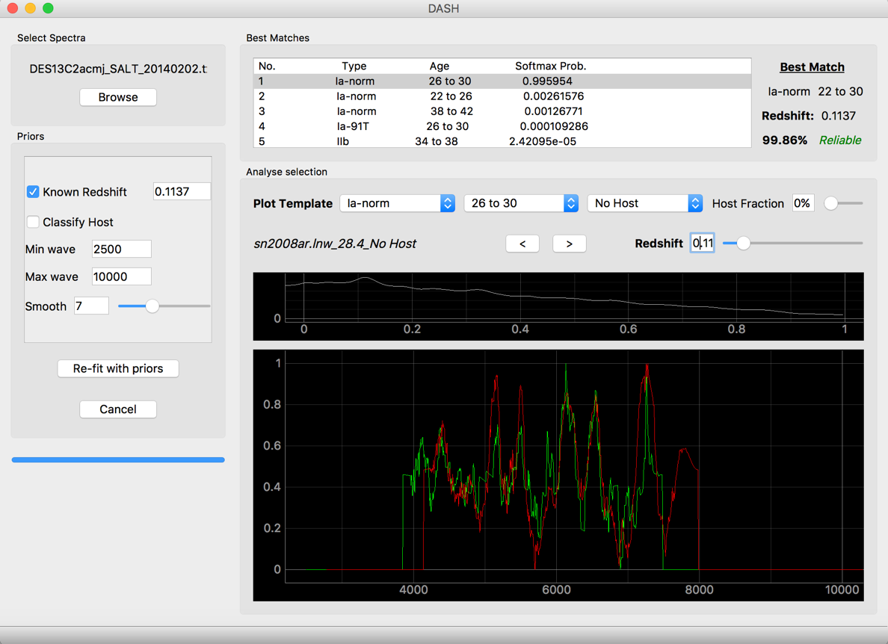

====
DASH
====
Software to classify the type, age, redshift and host for any supernova spectra. Two platforms exists: a python library 
that enables a user to classify several spectra (can classify thousands of spectra in seconds), and also a graphical
interface that enables a user to view and classify a spectrum. 

Documentation at: http://astrodash.readthedocs.io

1. Installation
---------------

In a terminal run:

.. code-block:: bash

    pip install astrodash --upgrade

2. Dependencies
---------------
Using pip to install DASH will automatically install the mandatory dependencies: numpy, scipy, pyqtgraph, and tensorflow.

PyQt5 is the final dependency, and is optional. It is only required if you would like to use the graphical interface.
If you have an anaconda installation, this should already be preinstalled, but can otherwise be simply installed by running the following in the terminal:

.. code-block:: bash

    conda install pyqt

Or, ONLY if you do not have anaconda and if you have python 3, it can be installed by running the following in the terminal:

.. code-block:: bash

    pip3 install pyqt5

3. Usage
--------

3.1 Graphical Interface
+++++++++++++++++++++++
There are three ways to open the graphical interface:

1. Run the following in the terminal:

.. code-block:: bash

    astrodash

**OR**

2. Open a python interpreter and run the following:

.. code-block:: python

    import astrodash
    astrodash.run_gui()

**OR**

3. Run the following in the terminal:

.. code-block:: bash

    python $INSTALL_DIR/gui_main.py

(Where $INSTALL_DIR is the directory where DASH has been installed.)

Once the GUI is open you may follow these steps:

1. Select one of the four models by ticking a combination of the 'Known Redshift' and 'Classify Host' check boxes. If Known Redshift is ticked, then the user must input a redshift. If it is unticked, then DASH will try to calculate the redshift.

2. OPTIONAL. Leave Min wave and Max wave unchanged, unless you want to limit the wavelength range of the input spectrum used for classification. (For example, you may choose to do this to remove bad parts of the spectrum, or to avoid dichroic jumps)

3. OPTIONAL. Changing the smooth function (minimum is 0 which means no smoothing) will change how much smoothing is applied to the spectrum before it is classified by DASH. You should generally leave this unchanged.

4. OPTIONAL. Check the Calculate rlap scores if you wish to view the score (same definition from SNID). These calculations are slow.

5. Browse for any single spectrum FITS, ASCII, dat, or two-column text file by clicking the 'Browse' button.

6. Click 'Re-fit with priors' to classify.

7. Click any of the best matches to view the continuum-subtracted binned spectra. You may also select a particular type, age, and host of a supernova using the combo boxes. You can set the fraction of host galaxy light in the spectrum with the slider. You may also change the redshift slider or the line on the x-corr plot to view changes in redshift.

8. Once you have selected the supernova type, you may use the two arrow buttons to change the supernova template which is plotted.

3.2 Python Library
++++++++++++++++++

Use the following example code:

.. code-block:: python

    import astrodash

    classification = astrodash.Classify(filenames, knownRedshifts, classifyHost=False, knownZ=True, smooth=6, rlapScores=False)
    bestFits, redshifts, bestTypes, rejectionLabels, reliableFlags, redshiftErrs = classification.list_best_matches(n=5, saveFilename='DASH_matches.txt')
    classification.plot_with_gui(indexToPlot=2)

astrodash.Classify() takes the following arguments:

    :filenames: is the only mandatory argument. It must be a list of strings of the supernova data files. Column seperated .dat, ASCII, or similarly formatted files are accepted. Single spectrum FITS files are also accepted.

    :knownRedshifts: is an optional argument, and is a list of floats corresponding the redshifts of each of the files listed in 'filenames'. If this argument is not included, then the redshift will be calculated by DASH.

    :classifyHost: is an optional argument (default=False). It specifies whether DASH should try to classify the host galaxy of the supernova data file.

    :knownZ: is an optional argument (default=True). It specifies whether DASH should try to calculate the redshift. If this is set to False, any redshift arguments given in knownRedshifts will be ignored.

    :smooth: is an optional argument (default=6). The higher this value, the more smoothing that is applied to the spectrum. This must be an integer greater than or equal to zero. If smooth=0, then no smoothing is applied.

    :rlapScores: is an optional argument (default=False). If this is set to True, then the rlap scores (as defined in SNID by Blondin & Tonry 2007) are calculated. This can be used as a secondary measure of confidence in the fit. Calculating the rlap scores is slow, and will increase the classification time.

To view the best matches, the 'list_best_matches' method takes three optional arguments:

    :n: (default=5) is the number of best matching classification bins to display for each spectrum.

    :saveFilename: (default='DASH_matches.txt') dictates the name of the file in which to save the best matches. The saved file is the best way to view the best Matches from DASH. If this is a None type or an empty string, the best matches will not be saved to a file.

The final line is optional. It plots the 3rd spectrum onto the graphical interface.

4. Platforms
------------
DASH can be run on Mac (tested on Sierra 10.12), most Linux distributions (tested on Ubuntu 16), and on Windows (tested on Windows 10).

1. Mac and Linux distributions:

    DASH is available on both Python2 and Python3 distributions, and easily installed with

        .. code-block:: bash

            pip install astrodash

2. Windows:

    Currently one of the primary dependencies, Tensorflow, is only available on Python 3 for Windows.
    So DASH is available on Python 3 distributions. It can be installed with:

        .. code-block:: bash

            pip install astrodash

    If this fails, try first installing specutils with the following:

        .. code-block:: bash

            conda install -c astropy specutils

5. Example
----------

Example script classifying some spectra from OzDES Run025/ATEL9570:

This example automatically classifies 10 spectra. The last line plots the fifth spectrum on the GUI.

.. code-block:: python

    import astrodash

    atel9570 = [
        ('DES16C3bq_C3_combined_160925_v10_b00.dat', 0.237),
        ('DES16E2aoh_E2_combined_160925_v10_b00.dat', 0.403),
        ('DES16X3aqd_X3_combined_160925_v10_b00.dat', 0.033),
        ('DES16X3biz_X3_combined_160925_v10_b00.dat', 0.24),
        ('DES16C2aiy_C2_combined_160926_v10_b00.dat', 0.182),
        ('DES16C2ma_C2_combined_160926_v10_b00.dat', 0.24),
        ('DES16X1ge_X1_combined_160926_v10_b00.dat', 0.25),
        ('DES16X2auj_X2_combined_160927_v10_b00.dat', 0.144),
        ('DES16E2bkg_E2_combined_161005_v10_b00.dat', 0.478),
        ('DES16E2bht_E2_combined_161005_v10_b00.dat', 0.392)
        ]

    # Create filenames and knownRedshifts lists
    filenames = [i[0] for i in atel9570]
    knownRedshifts = [i[1] for i in atel9570]

    # Classify all spectra
    classification = astrodash.Classify(filenames, knownRedshifts, classifyHost=False)
    bestFits, redshifts, bestTypes, rlapFlag, matchesFlag, redshiftErrs = classification.list_best_matches(n=5, saveFilename='ATEL_best_fits.txt')

    # Plot DES16C3bq
    classification.plot_with_gui(indexToPlot=4)

6. API Usage
------------
Notes: Sometimes inaccurate results if redshift is unknown.

6. Common Issues
------------
If you get an error like this:
    `ImportError: /lib64/libc.so.6: version 'GLIBC_2.17' not found`
which is often cause by older linux operating systems, try reinstalling tensorflow with:

        .. code-block:: bash

            conda install tensorflow

